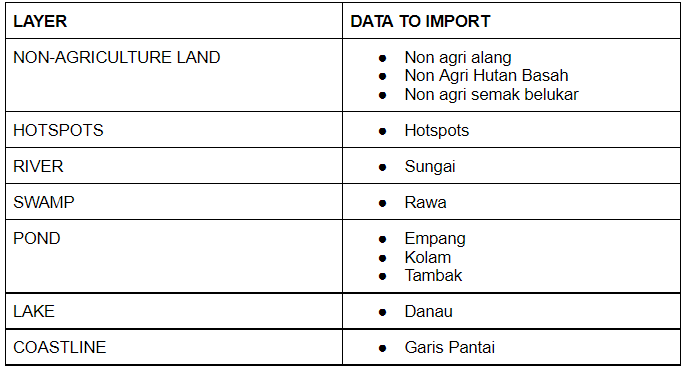
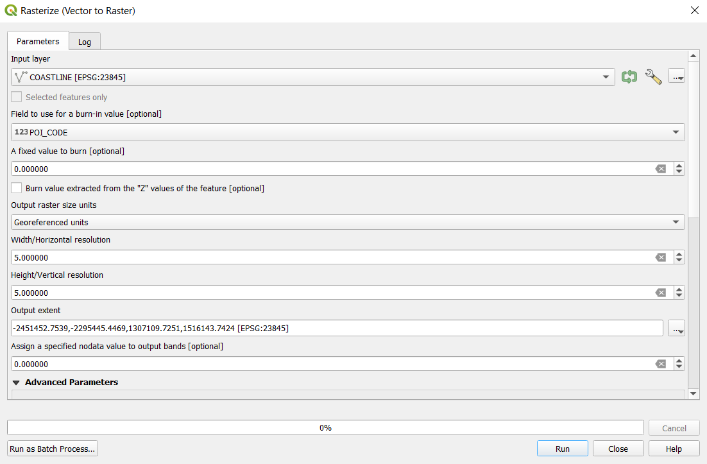
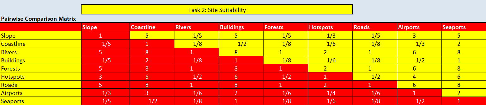
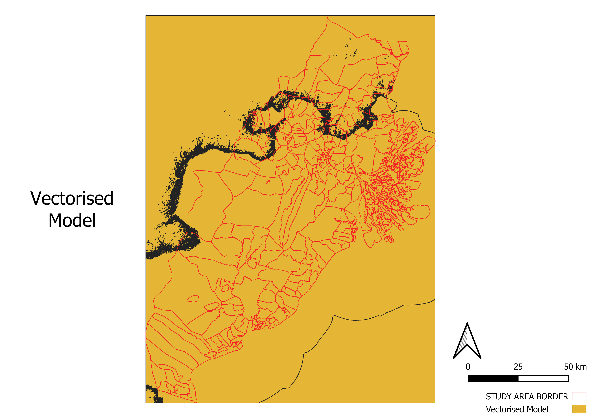
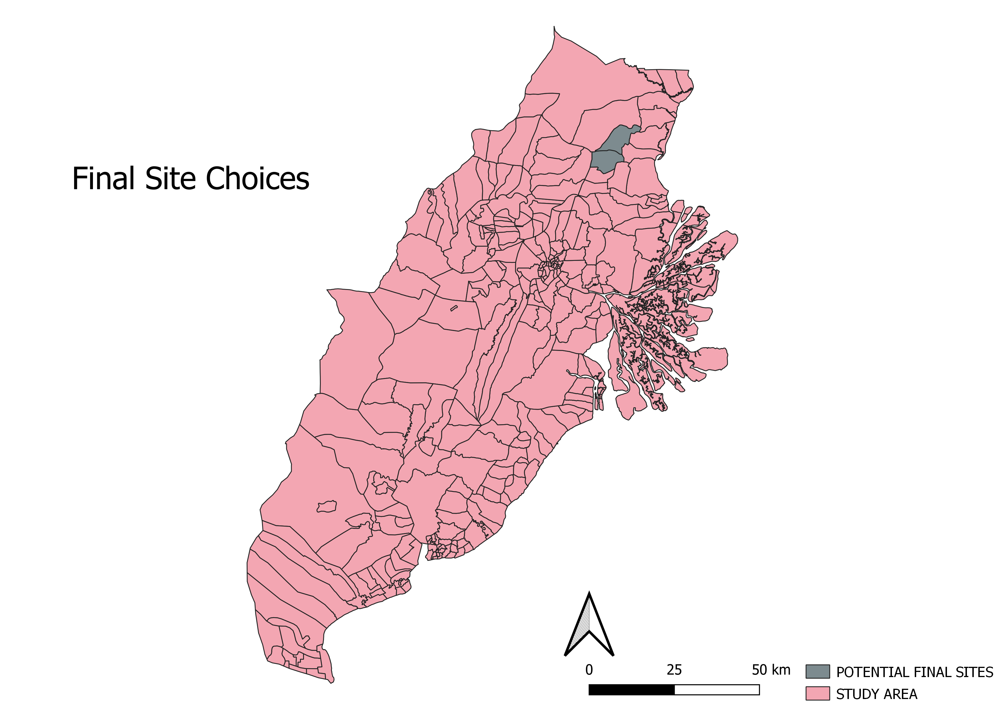
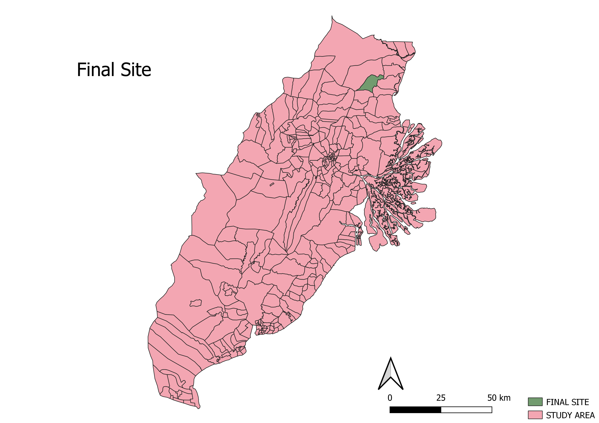

```{r setup, include=FALSE}
knitr::opts_chunk$set(echo = TRUE)
```
Before commencing, ensure GIS Map is in EPSG 23845 - click the bottom right button “EPSG” and select the one you want, in this case - DGN95 / Indonesia TM -3 zone 54.1 with EPSG 23845.

# 1.0 Data Compilation (Population Data, Topographic Data, DEM, Geological Data, Forest Fire Hot Spot Data, Buildings and Settlements Data

1. Download the respective shapefiles from Indonesia Geospasial that covers Kota Balipapan, Kota Samarinda, North Penajam Paser and Kutai Kartanegara Regencies
2. Input the shapefiles and raster file into the GIS map

# 2.0 Data Preparation (Vector-BasedData):
1. Export and “save feature as” all new vector layers into the correct EPSG (EPSG 23845).
2. Remove the previous layer 

*Population Data (Batas Desa & Data Kependudukan Tahun 2019 Seluruh Indonesia):*
1. Access the attribute table in the Population Data layer.

2.Using select by expression, select the following in “KAB_KOTA”:
  + KOTA BALIKPAPAN
  + KOTA SAMARINDA
  
3. Using the same select by expression, select the following in “KECAMATAN”:
  + ANGGANA
  + LOA JANAN
  + LOA KULU
  + MARANG KAYU
  + MUARA JAWA
  + SAMBOJA
  + SANGA SANGA
  + SEBULU 
  + TENAGGARONG
  + TENGGARONG SEBERANG
  + MUARA BADAK
  + BABULU
  + PENAJAM
  + SEPAKU
  + WARU
<center> 


</center>


4. Export and save the selected features as a new layer. This layer will be the study area.


5. Remove the previous layer.


# 2.1 Buidling & Settlement Data 

1. From Vector, click Geoprocessing Tools and Clip

<center>


</center>

2. Input building layer 1 as the input layer and the study area as the overlay layer.  

<center>


</center>

3. Click the tool icon next to the input layer and change the invalid feature filtering to “Do not filter”. Repeat for the overlay layer.

<center>


</center>

4. Click “Run”.

5. Export and save the feature as a new layer. This layer will be part of all the buildings and settlements within the study area.
6. Remove the previous layer.
7. Repeat steps 1-5 for the other two osm building layers.
8. From Vector, click Data Management Tools and Merge Vector Layers - input all the newly clipped osm building layers.
<center>

 

</center>

9. Press “Run”
10. Export and save the feature as a new layer. This layer will be all the buildings and settlements within the study area.


11. Remove previous layer. 


### 2.2 Geological & Hotspot Data

1. From Vector, click Geoprocessing Tools and Clip

2. Input geological data as the input layer and the study area as the overlay layer. 

3. Click the tool icon next to the input layer and change the invalid feature filtering to “Do not filter”. Repeat for the overlay layer.

4. Click “Run”.

5. Export and save the feature as a new layer. This layer will be the geological data within the study area.

6. Remove the previous layer.

7. Repeat steps 1-6 for the hot spot data to obtain the layer with the hot spot data within the study area.

# 2.3 Data Preparation (Raster-Based Data) 
1. From Raster, click Extraction and Clip Raster by Extent


2. Input DEM as the input layer and the study area as the clipping extent.  


3. Click "Run"
4. Export and save the feature as a new layer. This layer will be the DEM of the study area.


5. Remove previous layer 

### 2.4 Slope Data 
1. From Raster, click Analysis and Slope.


2. Input DEM (Study Layer) as input layer.

 

3. Click "Run"

4. Export and save the feature as a new layer. This layer will be the slope of the study area.


5. Remove the previous layer. 


# 3.0  Data Preparation, Wrangling, and Cleaning (Task 1) 

# 3.1 Population & Demographic 

## 3.1.1 Population Density 
1. Extract the population layer and study area 

 

2. Using clip, clip the population layer using study area as a reference. 

 


3. Save the clip layer into your geopackage. Name this layer population. 

 

4. To make the population density map, right click on the population layer and click on properties. 
5. In properties, go to the tab “Symbology”. 
6. Under symbology, change “single symbol” to “graduated”. For value, use “Kepadatan” which means density. Use the color ramp blues, greens, or red to show the distribution. Refer to the image below as a guide. 

 

7. After done, click"apply". You should get a map similar to the image below


## 3.1.2 Demographic - Young, Adult, Elderly 

1. From your geopackage, import 3 other population layers. You should get the same layer as the image below.

 

2. Open the attribute table, and then field calculator. 

3. In the field calculator tab, add a new field called “YOUNG”

4.  For field type, input “Whole number (integer)”. For expression, add ages 25 and below. Refer to the image below as a sample. 


5. After done, click ok and save the attribute table.

6. To present the distribution of the young, go to properties → Symbology

7. Under symbology, change “single symbol” to “graduated”. For value, use “YOUNG” which means density. Use the color ramp blues, greens, or red to show the distribution. Refer to the image below as a guide. 

 

8. Click apply and you should see a map similar to the map in the image below. 


9. Repeat steps 2 to 8 for ADULT and ELDERLY layer, where ADULT’s age is from U30-U65(inclusive) and ELDERLY’s age is from U70-U75 (inclusive)

# 3.2 Economic & Business
For Economic & Business, the maps which we will be creating are agriculture(Agriladang, Agrishawah, Agri Kebun), industrial sites (industri), mining, financial institutions, recreational, commercial, and manufacturing. 

## 3.2.1 Commerce
Financial institutions, recreational, commercial, and manufacturing layers will be created from the commerce layer (niaga).

1. Insert “Niaga” layer from each of the different regions. There should be 4 in total.
2. In your toolbar, go to “Vector” → “Data Management Tools” → “Merge Vector Layers” 


3. In the pop-up, select the 4 niaga layers, one from each region. After which, select the correct EPSG (EPSG 23845). Then click “Run”. You should see a temporary “merge” layer. 

4. In your toolbar, go to “select by location”. 

5. Under this pop-up, select from the merge layer, and use “STUDY AREA” as an overlay. Make sure that for each layer, we do not skip anything. Refer to the image below for a reference 

 


6. Click “Run”
7. Right click on the “Merge” layer → “Export” → “Save selected feature as” and save this layer into your geopackage. Name this layer COMMERCE. 
8. To make the financial institution layer, click on select by expression on the active commerce layer. 
9. Under expression, follow the inputs in the image below. Click “Select Features” after that.


10. Right click on the commerce layer → export → save selected features as → save it into geopackage, naming this layer “Financial Institutions” 

11.For the remaining layers using commerce, just import “Commerce” layer from browser panel and repeat steps 8 to 10, but according to the categories in the table below. 


## 3.2.2 Industry Sites 

1.For industrial sites, import “industri” from all the regions.

2.Merge the industri layers using the same method in step 7 of the commerce layer. 

3.Select by location → Select features from “Merged” layer → where the features “Intersect” → By comparing to the features from “STUDY AREA” 

4.Right click on “Merged” layer 

5.Export → Save selected features as “INDUSTRY SITES”


## 3.2.3 Agriculture & Mining 
Similar to industry sites, repeat steps 1-2 for the agriculture and mining layer. 

However, for step 1, follow according to the table below for the datasets to import:


1. After importing datasets, merge the layers respectively

2.Instead of using “selection by location”, go to toolbar → vector → Geoprocessing tools → Clip 

3.Input layer → Respective merged layer ; Overlay layer → “STUDY AREA” ; Ensure that both setting are set to “Do not Skip” 

# 3.3 Infrastructure 
Datasets used for this layer are: 


Using Education as an example:

1. Import Pendidikan from all 4 regions. 

2. Merge the 4 layers using the same method as above (Vector → Data Management Tools → Merge Vector Layers)

3.Since they are all point data, we can use the select by location approach. Select by location → Select features from Merged layer → Where the features “Intersect” → By comparing features from “STUDY AREA” 

4. Click “Run” and this should select those education points that have intersected with the study area. 

5. Right click on the merge layer → Export → save selected features → Save into geopackage and name is “EDUCATIONAL” 

6. To change symbology, right click on “EDUCATIONAL” layer and select properties

7. In properties pop-up, go to “Symbology” tab 

8. Click on “Simple Marker” and change to SVG marker 

 

9. Under SVG browser, select the appropriate icon that you think best represents education

 

10.After selecting, change the size that you deem fit (i.e 5x5)

11. After changing the size, click on “Apply” and “Ok” and the changes should be seen on the map. 

12. Repeat the above steps for the other layers - Electricity, Water, Public Amenities, Dams. 

13. Your final map should look something similar to the image below. 


# 3.4 Transport & Communication 
Datasets used for this layer:

 


## 3.4.1 Transports & Telecomms 

Using Bus Terminal Layer as an example:

1. Import TerminalBus_PT from the 4 different regions 

2. Merge the 4 layers above using the same method as above. (Vector → Data Management Tools → Merge Vector Layers)

3. Using the select by location approach: Select by location → Select features from Merged layer → Where the features “Intersect” → By comparing features from “STUDY AREA” 

4. Right click on merged layer → export → save selected features as → Save into geopackage and name this layer “BUS TERMINAL”

5. To change the symbology, refer back to step 6 to 11 of the infrastructure layer.

6. Repeat these steps for the other 3 layers.

7. Your final map should look like the image below. 


## 3.4.2 Roads 

1. Insert Road layer from each of the different regions. There should be 4 of them. 

2. Merge the road layers using the merging method used above 

3. Using the Clip method (Toolbar → Vector → Geoprocessing Tools → Clip), clip the merged layer using STUDY AREA as an overlay area. Ensure that settings is set to “Do not filter”, similar to the image below. 


4. Click “Run” and you should get a temporary layer called “Clipped” in the layer panel. 

5. Save that layer into your geopackage and name it ROADS. 


# 3.5 Environmental & Hazards 
Datasets to be imported & used for each layer : 



Using Non-Agriculture Land as an example:

1. Import non-agri aland, non-agri hutan basah, non-agri belukar from each of the 4 regions. 

2. Merge these layers using the merge layer used for the previous layers 

3. Being an area datatype, we will be using the Clip approach. 

4. Clip approach:  Toolbar → Vector → Geoprocessing Tools → Clip 

5. In the clip pop-up, input layer → Merged layer, overlay layer → STUDY AREA. Ensure that the settings for both layers are set to “Do Not Skip”, similar to the previous layers

6. After clipping, saved the temporary clipped layer by right clicking on the clipped layer → Export → Save layer as → Save into the geopackage and name this layer as “NON AGRICULTURE LAND” 

7. (Only for non-agriculture land layer) To differentiate the different non-agriculture land, right click on the NON AGRICULTURE LAND → properties → symbology tab 

8. Under symbology tab, change single symbol to categorized, value → layer, Color ramp → random colours 

9. Then click classify & apply. Refer to image below as reference.


10. Repeat steps 1 to 6 for the other layers including coastline even though it is a line datatype.

# 3.6 Geology 

1. Using the geology layer already made, right click on the layer → Properties

2. In the properties pop-up, go to the symbology tab. 

3. Change single symbol to Categorized, value → CLASS_LITH, color ramp → random colors 


4. Click  “Classify” and apply. You should get a map similar to the image below


# 3.7 Topography 

1. Duplicate the DEM (STUDY AREA) layer and name this layer DEM (STUDY AREA) COLORED

2. Right click on the layer → Properties 

3. In the properties pop-up, go to the symbology tab. 

4. Change render type to Singleband pseudocolor

5. Change color ramp to spectral and invert color ramp


6. Click  “Classify” and apply. You should get a map similar to the image below


7. Download and click on plugin Qgis2threejs. Ensure DEM (STUDY AREA) COLORED is ticked with the study area border.

8. From Scene, click on Scene Settings

9. Within the scene setting dialog box, write “20” in vertical exaggeration

10. Click apply and you should have a map as seen below.

 


# 4.0 Data Preparation & Wrangling (Task 2) 

# 4.1 Layers used for Site Selection 

* Raster 
  + Slope 
  
* Vector 
  + Coastline 
  + Rivers 
  + Buildings 
  + Forests 
  + Hotspots 
  + Roads 
  + Airports 
  + Seaports 


# 4.2 Rasterization of Vector Layer 
1. Click on Coastline Layer
2. From the icon bar, click on Open Attribute Table icon
3. Click on Open field calculator icon
4. Within the Field Calculator dialog window:
  *Type “POI_CODE” under Output field
  *At the Expression pane, type 1
  *Click “OK”. There will be a new field called POI_CODE added onto the attribute table of the coastline GIS layer.
  
5. From Raster, select Conversion and Rasterise (Vector to Raster)

 

6. Within the Raster (Vector to Raster) dialog window:

*For Input layer, select Coastline

*For Field to use for a burn-in value, select POI_CODE 

*For Output raster size units, select Georeferenced units

*Keep both horizontal and vertical resolutions at 5

*For output extent, click on Calculate from Layer and select DEM (Study Area)

*Click Run

*Close



7. Export and save the feature as a new layer as raster_coastlines. This layer will be the rasterized coastline in the study area.

8. Remove the previous layer.

9. Repeat steps 1 to 8 with the other vector layers. See an example of raster_river below:


# 4.3 Proximity of Layers 

1.From Raster, select Analysis and Proximity (Raster Distance).


2. Within the Proximity (Raster Distance) dialog window:
  *For Input layer, select raster_coastlines.
  *For Distance units, select Georeferenced coordinates.
  *For Output data type, select Float32.
  *Click Run.
  
  

3. Export and save the feature as a new layer as prox_coastlines. This layer will indicate distance away from the coastline in metres as seen below.


4. Remove the previous layer.
5. Repeat steps 1 to 4 with the other rasterized vector layers.

# 4.4 Site Selection using GIS Multiple-Criteria Decision Analysis

1. From Processing, click Toolbox.

2.Search and click for Raster Calculator.

3.Under expression, use the formula below to calculate the z-score of the coastline proximity layer. You can find the minimum and maximum from properties of the proximity layer. If there is a preference for distances closer to the feature in the layer, do the formula below but with min(x) and max(x) swapped.

4.Under the Reference Layer, input DEM (Study Area).


 

5. Click "Run"

6. Export and save the feature as a new layer as factor_coastlines. This layer will indicate z-score away from the coastline in metres.

7. Remove the previous layer.

8. Repeat steps 1 to 5 with the other proximity layers including slope DEM.

# 4.5 AHP Analysis

1. Download the AHP template from https://www.scbuk.com/ahp.html 

2. Input n = 9 since we will be using 9 factors 

3. Weigh the importance of the factors in the pairwise comparison matrix

 

4. Ensure the consistency is below 10% to confirm the AHP analysis as valid


# 4.6 AHP Suitability

1. Use the Raster Calculator

2. Under expression, sum up the factor layers multiplied with its respective weightage as noted in the AHP

3. Under the Reference Layer, input DEM (Study Area).


4. Click Run.

5. Export and save the feature as a new layer as AHP_Suitability. This layer will show grids where values closer to 1 are more suitable than locations with values closer to 0.


6. Remove previous layer


# 4.7 Identifying Suitable Sites

1. From Processing, click Toolbox.
2. Search and click for Reclassify by Table.
3. Within the Reclassify by Table dialog box:

  * For Raster Layer, select AHP_Suitability
  * For the Reclassification table, click on the icon. Within the Fixed table dialog box:
    + Enter the value similar to the screenshot below
    + Click OK
    
<center>
     
 
    
</center> 
    
  *For Range boundaries, select min <= value < max
  *For Output data type, select Float32.
  *Click Run
  
  
  
    
    
4.Export and save the feature as a new layer as MCDA_model. This layer will show the suitable sites and not suitable sites, where the white areas are suitable and black areas are unsuitable.


5. Remove the previous layer.


# 4.8 Vectorise Suitable Sites

1. From Raster, select Conversion and Polygonize (Raster to Vector)


2. Within the Polygonize (Raster to Vector) dialog box:
  *For Input Layer, select AHP_Suitability.
  *For Name of the field to create, type Sites.
  *Keep the checkbox in front of Use 8-connectedness uncheck.
  *Click Run
  

  
3. Export and save the feature as a new layer as Vectorised Model. This layer will show the suitable sites and not suitable sites.



4. Remove the previous layer.

# 4.9 Choosing Final Site (Vectorised Model)

1. Open the attribute table of the Vectorised Model

2. Using Select by Expression, select areas where sites = 1.

3. Deselect areas not within the study area.

4. Export and save the selected feature as a new layer as All Suitable Sites. This layer will show the suitable sites

 

5. From Processing, click Toolbox.

6.Search and click for Fix Geometries.

7. Within the Fix Geometries Dialog Box:

  + Input All Suitable Sites as the input layer.
  + Click Run 
  
 

8. Export and save the feature as a new layer to replace All Suitable Sites.

9. Remove the previous layer.

10.From Vector, click Geoprocessing Tools and Clip

11.Input All Suitable Sites as the input layer and the study area as the overlay layer.  

12. Click the tool icon next to the input layer and change the invalid feature filtering to “Do not filter”. Repeat for the overlay layer.

13. Click “Run”.

14. Export and save the feature as a new layer as Potential Sites. This layer will be the suitable sites within the study area.


  
15. Remove the previous layer.

## 4.9.1 Choosing Final Site (Subzones)
1.Click on Select by Location.
2.From the Select by Location dialog box:
  + Select features from “Study Area”
  + Tick “are within”
  + By comparing to the features from “Potential Sites”
  + Click Run
  
 

  
3. Export and save the feature as a new layer as Potential Sites. This layer will be the suitable subzones within the study area.

.png)

4. Remove the previous layer.

5. From Project, click Properties.

6. Under General, change the units for area measurement to hectares.


7. Click apply.

8. Click on the Potential Final Sites layer.

9. From the icon bar, click on Open Attribute Table icon

10. Click on Open field calculator icon

11. Within the Field Calculator dialog window:
  
  + Type “AREA” under Output field
  + At the Expression pane, type $area
  
  
  
12. Click “OK”. There will be a new field called AREA added onto the attribute table which indicates the area of the different potential subzones in hectares.


13. From there, use select by expression.

14. Under expression, write down the following to find subzones that fit the required area size.


15. Export and save the feature as a new layer as Final Site Choices. This layer will show the final subzone sites that fit all criteria including the required area.



16. As both subzones are relatively in the same location, we chose the one with the larger size. Hence, we selected Prangat Selatan.


17. From there, use select by expression.

18. Under expression, choose the subzone with Desa =  Prangat Selatan.

19. Export and save the feature as a new layer as Final Site. This layer will show the final site we chose to put the new capital city which is Prangat Selatan.



20. Remove the previous layer.

  


  

