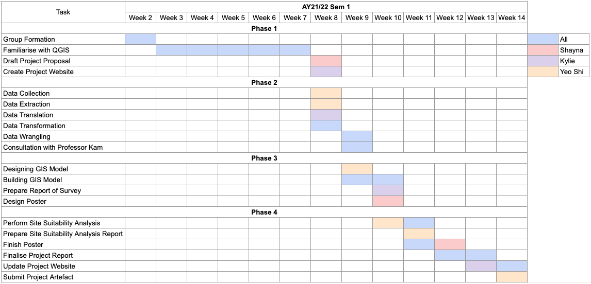

```{r setup, include=FALSE}
knitr::opts_chunk$set(echo = TRUE)
```
# 1.0 Introduction

In 2019, Indonesia’s president, Joko Widodo announced that his plan to move the national capital from Jakarta to the province of East Kalimantan. This relocation is to address economic inequality and relieve some of Jakarta’s serious urban problems. However, there have been doubts about whether this relocation plan will solve Jakarta’s problems and concerns surrounding the impact of relocation on Kalimantan. Our team aims to create digistised web maps via QGIS and analyse the geospatial patterns through various methods of analysis, to determine and recommend a suitable site for the relocation of the capital city.


# 2.0 Project Proposal 

## 2.1 Motivation
 
In 2019, Indonesia’s president, Joko Widodo announced that his plan to move the national capital from Jakarta, on the island of Java, to the province of East Kalimantan, on Borneo. The relocation is believed to address economic inequality and relieve some of the heavy burden, which has led to serious urban problems - such as intensive floods, air pollution and overcrowding, on Jakarta (The Guardian, 2019). Moreover, compared to Jakarta, Kalimantan is located strategically in the centre of Indonesia and close to urban areas.

However, the relocation has raised some concerns with environmentalists fearing the relocation will have negative effects on Kalimantan - ecologically damaging the rainforests habitat for wildlife species, notably the remaining orangutan population (Eliraz, 2020).

Hence, it is important to determine a suitable area in East Kalimantan for the relocation of the capital. Bearing in mind that the new area would meet the criteria of functioning as a capital city and as the centre of governance, without risking environmental damage to the rainforests and endangering wildlife. 

## 2.2 Objective 

Our team aims to fulfill the following project objectives:

1.Creation of digitised web maps via QGIS to clearly show the different aspects of the study area

2.Analysis of geospatial patterns in the compilation of maps created

3.Integration of GIS and multi-criteria evaluation methods to perform site suitability analysis

4.Discussion of method of analysis when weighing the different aspects for site suitability

5.Providing a recommendation of a suitable site for the relocation of the capital city

6.Gain experience in using QGIS and project exposure

## 2.3 Data

Name                                              |Data Format|Description                                                              | Link
--------------------------------------------------|-----------|-------------------------------------------------------------------------|---------------
BATAS DESA DESEMBER 2019 DUKCAPIL KALIMANTAN TIMUR|Shape files|Comprehensive population data of the East Kalimantan Province            |https://drive.google.com/file/d/1aeD6kPAy6Uzzx61Z51mfEI5FQzDCY_kJ/view?usp=drivesdk 
KOTA_BALIKPAPAN                                   |Shape files|Comprehensive collection of topographic data layers of Kota Balikpapan   |https://drive.google.com/file/d/1VgxlToSH1auqApEgh_jAW06DKlBy67Bh/view?usp=drivesdk 
KOTASAMARINDA                                     |Shape files|Comprehensive collection of topographic data layers of Kota Samarinda    |https://drive.google.com/file/d/12kiqmm_wsyjc2-pqNO2e8TM_c-fMeTAk/view?usp=drivesdk 
PENAJAMPASERUTARA                                 |Shape files|Comprehensive collection of topographic data layers of Penajam Paser Utara|https://drive.google.com/file/d/1SkS3y_pF7avPfvNTft7RK5W3p4fJ2KEr/view?usp=drivesdk 
KUTAITARTANEGARA                                  |Shape files|Comprehensive collection of topographic data layers of Kutai Kartanegara | https://drive.google.com/file/d/1EfoR3qJEX1qX5d4tUOGFLhEaSxa4Du1o/view?usp=drivesdk 
30. Provinsi Kalimantan Timur                     |TIF File   |Digital elevation model of the East Kalimantan Province at 30m resolution|https://drive.google.com/file/d/1-LIP45j41T7psyy1gUvJBaj-MSWb9rK1/view?usp=drivesdk  
23. Geology Kalimantan Timu                       |Shape files|Geological data layer of the East Kalimantan Province (Raster Layer)     |https://drive.google.com/file/d/1Ke99g1lqXIx2ku2Vy8CBxl62L8Htv3Ce/view?usp=drivesdk 
Tituk Api Hotspot se-Indonesia Tahun 2019         |Shape files|Forest fire hotspot data of Indonesia in 2019                            |https://drive.google.com/file/d/1Kc1e_Ti6_LzystyWjdMcy1QjmQEKMuu4/view?usp=drivesdk 
OSM Buildings                                     |Shape files|Buildings and settlement data of Indonesia                               |https://drive.google.com/file/d/1iTvLFztIJQfcIxVZ-Tu8CUZevrSbvchO/view?usp=drivesdk 


## 2.4 Scope of Work 

Our team was tasked to specifically survey the East Kalimantan Province, which consists of districts and sub-districts from four areas: Kota Balikpapan, Kota Samarinda, Kutai Kartanegara and Penajam Paser Utara in Indonesia and to identify a suitable site in this study area to build the new capital.


This will be achieved by studying and reporting on the study area in seven aspects:

* Population and Demographics

* Economic and Business

* Transport and Communication

* Infrastructure

* Environment and Hazard

* Geology

* Topography


Here, we will identify any patterns and trends in the geospatial distribution of the above aspects, and comment.

Followed by thoroughly investigating and analysing the study area, we will recommend a suitable site within our study area for the proposed new capital city based on four overarching criteria:

* Sizable
  + Area has to be between 4500-5500 hectares in size
  
* High accessibility
  + Near road transport
  + Near airports and seaports
  + Near current urban settlement areas
* Safety
  + Avoid potential natural disaster risk areas such as coastlines and major rivers
  + Avoid forest fires hot spots
* Ease of development
  + Avoid steep slopes
  + Avoid natural forests

Here, we will weigh the above factors over the study area and analyse which areas are best suited to build the capital city to achieve these conditions.


# 2.5 Project Schedule 



# 3.0 References
Eliraz, G. (2020, March 28). The many reasons to move Indonesia's capital. The Diplomat. Retrieved November 15, 2021, from https://thediplomat.com/2020/03/the-many-reasons-to-move-indonesias-capital/. 
The Guardian. (2019, August 27). Why is Indonesia moving its capital city? everything you need to know. The Guardian. Retrieved November 15, 2021, from https://www.theguardian.com/world/2019/aug/27/why-is-indonesia-moving-its-capital-city-everything-you-need-to-know. 


