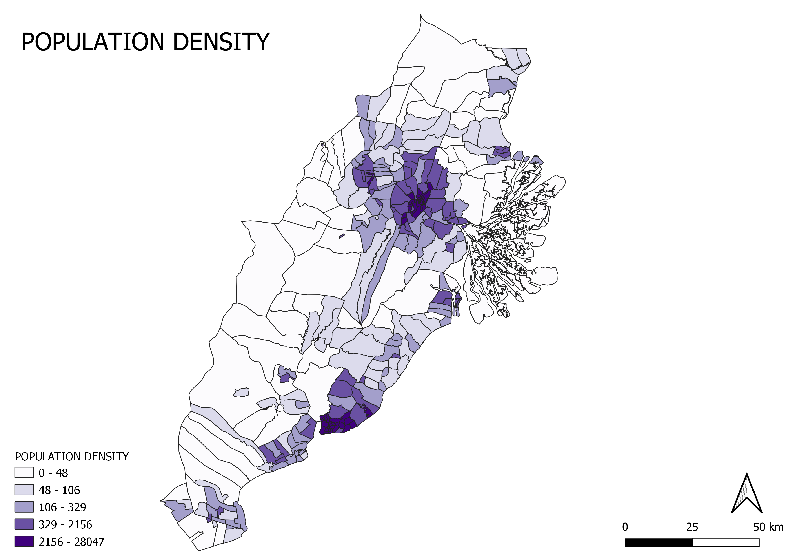

```{r setup, include=FALSE}
knitr::opts_chunk$set(echo = FALSE)
```

# Our Study Area 

<center>


</center>


# 1.1 Population & Demographics 

## 1.1.1 Population Density 

<center>



</center>
    


Population density is the number of people living in an area per square kilometre and is calculated by dividing the number of people over the size of the area. Population density allows us to determine the extent of an area being overpopulated or unoccupied. The population density of East Kalimantan is unevenly distributed, where the darker the purple colour, the greater the population density. Kota Samarinda and Kota Balikpapan experiences the highest population density, with certain zones having a high population density of 2156 - 28047 people per square kilometre. On the other hand, Kutai Kartanegara and Penajam Paser Utara, notably the North, East and South-West of Kutai Kartanegara and the North-West of Penajam Paser Utara, experiences low population density, with certain zones having a population density as low as 0 - 48 people per square kilometre.


## 1.1.2 Age Demographics 

<center> 


</center>


<center>


</center>


<center>


</center>

We split the population of our study area into three groups: young (<= 25 years old), adult who are the economically active group (26 - 65 years old) and elderly (>= 66 years old). The darker the blue colour, the greater the population size. In line with our population density analysis in section 1.1.1, all three age demographics show a similar distribution to that of Figure 2., whereby the majority of the population of the three age demographics are found in Kota Samarinda and Kota Balikpapan and there’s a smaller population of the three age demographics found in Kutai Kartanegara and Penajam Paser Utara. This is due to the fact that Kota Samarinda and Kota Balikpapan are cities - urbanised areas with greater and better quality employment and educational opportunities, compared to Kutai Kartanegara and Penajam Paser Utara which are regencies. 

While the distribution of each age demographics is similar across Figures 3. - 5., there is a smaller population of elderly along the West coast of Kutai Kartanegara, with a value of 11 - 44 elderly, in proportion to the population size of the young and adults. This can also be explained by the fact that Kota Samarinda and Kota Balikpapan are cities with likely higher quality and advanced health services for the elderly. Hence, being in close proximity to these health services would be convenient for elderly, explaining the higher proportion of elderly living in Kota Samarinda and Kota Balikpapan.

Comparing the values of the population size across the three age demographics, the study area likely experiences a high youth age dependency ratio, although those aged 0 - 14 years old are considered youths. The population of the young is almost similar to that of the adults, who are considered the economically active group. 


# 1.2 Economic & Business 

<center> 


</center> 

Based on a recent study on the economy of Sabah and Kalimantan, referring to Table 1, the information clearly shows that mining and quarrying, followed by manufacturing are the most important contributors to the income of East Kalimantan.


<center>


</center>


<center> 


</center> 

Referring to Figure 6a., the economic and business points are unevenly distributed across the study area. Majority of the economic and business points are concentrated at Kota Samarinda and Kota Balikpapan. Comparing between Kota Samarinda and Kota Balikpapan, besides commercial sites for both, recreational businesses predominantly occupy Kota Samarinda, while industrial sites predominately occupy Kota Balikpapan. Manufacturing locations, which is one of East Kalimantan’s primary source of income, are rather sparse but can be found along the outskirts of Kota Samarinda and Kota Balikpapan. 

Referring to Figure 6b., the agricultural land is rather evenly distributed across the study area, with the exception of the South of Penajam Paser Utara having a large plot of agricultural land. Regarding the distribution of mining fields, which is East Kalimantan primary source of income, majority of the mining fields are concentrated in Kutai Kartangeara, specifically around the outskirts of Kota Samarinda. However, there is still considerably little mining fields in the study area.

Referring to both Figure 6a. And 6b., there is barely any economic and business activity in the North and South-West of Kutai Kartanegara.


# 1.3 Transport & Communication 

<center>


</center> 


Transportation terminals and telecommunication points are unevenly distributed across the study map. All three transportation terminals, bus terminal, seaports and airports, are found concentrated in and around the outskirts of Kota Samarinda and Kota Balikpapan. Notably, there are only two airports in the study area, of which one each is located along the edges of Kota Samarinda and Kota Balikpapan. There are some seaports located away in Kutai Kartanegara and Penajam Paser Utara, but majority of the seaports are located in or near Kota Samarinda and Kota Balikpapan.

Telecommunication points are significantly concentrated in Kota Samarinda, with some located randomly in Kutai Kartanegara and Kota Balikpapan. Notably, there is little to no telecommunication point in Penajam Paser Utara.


# 1.4 Infrastructure 

<center> 


</center>

Infrastructure is unevenly distributed across the study area, with most of the infrastructure concentrated in Kota Samarinda and Kota Balikpapan. Education and public health are the two infrastructures that are the most distributed across the study area. Besides Kota Samarinda and Kota Balikpapan, education and public health infrastructure can be found in the South of Penajam Paser Utara, in the South, West and along the coast of the South-East of Kutai Kartanegara. However, infrastructure, like water, electricity and public amenities, is predominantly found in Kota Samarinda and Kota Balikpapan, with an exception of along the coast of the South-East of Kutai Kartanegara. This distribution is likely due to the fact that Kota Samarinda and Kota Balikpapan are cities, urbanised and with a higher population density.

# 1.5 Environment and Hazard 

<center>


</center> 

The predominant non-agriculture greenery is bush in the study area. Both Kota Samarinda and the South of Kutai Kartanegara has a high area of non-agriculture bush area. On the other hand, there is a low are of non-agriculture land and forest in the study area. The majority of non-agriculture land is found to the East of Kutai Kartanegara. There are two areas of non-agriculture forest found in the study area, with the smaller and bigger area found towards the East and South of Kutai Kartanegara respectively.


<center> 


</center> 

The most significant water body in the study area is the large area of pond at the East of Kutai Kartanegara, followed by the major river that cuts across the width of, from the West to the East of, Kutai Kartanegara and Kota Samarinda. There are multiple small water bodies of swamps and lakes scatter across the study area. The coastline stretches along the East coast of the study area, covering the East coast of both Kutai Kartanegara and Kota Balikpapan, up till the around the mid point of the East coast of Penajam Paser Utara.

<center> 


</center>

Forest fire hot spots are found predominantly towards the and are scattered around the North of the study area.

# 1.6 Geology 

<center> 


</center>


The distribution of geology sediments follows a trend, whereby the primary sediment is sandstone found along the entire West to central of the study area. The sediment trend then transitions to claystone and then alluvium when nearing the East coast of the study area, as the land is closer towards the ocean. An exception is flish sediment that is found amidst sandstone and claystone.


#1.7 Topography

<centre> 


</centre>

<centre>


</centre>


<centre>


</centre> 

There is a series of steep slopes at the South-West region of the study area, reaching peaks of up to 867m which can indicate a mountain range as mountains are landforms that rise above 300m. Other than that, there are a few areas of slight elevation at the Northern, central and Southern regions of the study area. The areas at the East hardly have any elevation, as it is the delta of the major rivers.


# 1.8 References 
​​Idris, R., Mansur, K., &amp; Idris, R. Z. (2019). Economy of Kalimantan: a Snapshot. In Studies on The Economy of Sabah and Kalimantan Towards Greater Economic Interaction in Borneo (1st ed., pp. 3–8). essay, IPB Press Printing.


