```{r setup, include=FALSE}
knitr::opts_chunk$set(echo = FALSE)
```
# 1.0 Site Selection Report

In this section, we will be thoroughly investigating and analysing the study area, to select a suitable site within our study area for the proposed new capital city based on four overarching criteria:

* Sizable

* High accessibility

* Safety

* Ease of development


# 2.0 AHP Analysis

Before performing site selection, we conducted Analytical Hierarchical Process (AHP) analysis to determine which criteria are more important in decision making by quantifying them. This aids in the process of achieving our goal: to determine a suitable area in East Kalimantan for the relocation of the capital. Bearing in mind that the new area would meet the criteria of functioning as a capital city and as the centre of governance, without risking environmental damage to the rainforests and endangering wildlife. 

<center>

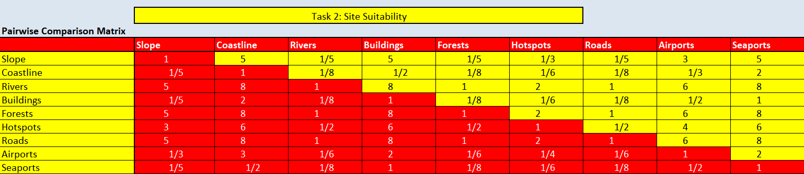

</center>


<center>

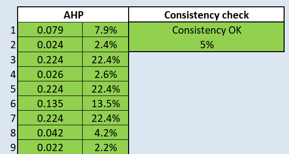


</center>

We set n = 9 for the number of criterias to be used in our AHP calculation and ranked these criteria at varying importance level based on the fundamental scale, which will be further explained later. The consistency check of 5% is below 10% and the inconsistency is acceptable. With the final calculated AHP scores, each criteria had a different and relevant importance level to the context of relocating Indonesia’s capital, which aid in the process of determining the final suitable site.


Ranking|Criterion | Reason                |
------ | -------- | ----------------------|
1 | Rivers |East Kalimantan is classified as a high risk exposure to a high level of river flood hazard, meaning that potentially damaging and life-threatening river floods are expected to occur at least once in the next 10 years (ThinkHazard, n.d.). With a building of a city, an urban area, there is a risk of urban floods due to the impemearble urban surface. Moreover, with climate change, there has been more frequent and extreme heavy rainfall events, increasing the river flood hazard level in the near future. |
1 | Forests|If the chosen site for relocation is on or near forested areas, deforestation would likely take place to make space for buildings and urbanisation. However, East Kalimantan is known for its large areas of forests where indigneous people live and various wildlife habitat, such as orangutans (Chandran, 2019). With deforestation, indigneous people would be displaced along with a loss of cultural heritage and also endangering wildlife species. Moreover, with global warming, deforestation should be avoided as much as possible. |
1 |Roads|Road infrastructure is a very important public asset. Roads provide high accessibility and convenience, and open up more areas, of which all stimulate economic development and bring about social benefits (Malkoc, 2015). For example, one aspect to address economic inequality and poverty, which is one reason Jokowi called for the relocation of the capital, is through providing access to employment, social, health and education services.|
4 |Hotspots|If the chosen site for relocation is near a fire hotspot, there can be considerable financial losses for the new capital. Outbreaks of wildfire can disrupt the living conditions of those in the capital. Moreover, the capital would need to channel resources to wildfire mitigation measures. As such, it is preferable for the new capital to be located away from hotspots. However, compared to floods, the frequency and severity of wildfires are primarily influenced by the changing climate and not much by urbanisation. Hence, hotspots are of a lower rank of importance compared to rivers.|
5|Slope |It is important for the selected site to avoid steep slopes due to the high development costs and constraints when developing buildings on slopes. Moreover, buildings and housings are more susceptible to landslides hazards on slopes. However, there can be landslide mitigation measures for buildings. The risks and severity of landslides are also dependent on the soil type.|
6| Airports |Airports are important to the economic sector of the capital, maintaining and improving the capital’s national and international trade relations, and are catalysts for tourism growth (Berti, 2019). However, it is important to note that airports need to be strategically located. Not only do airports need to be close and accessible for the citizens, thus the importance of roads before airports, they also need to be of a certain distance from residential areas as much as possible due to noise pollution.|
7|Buildings |It is important for the selected site to be near to current urban settlement areas, such that the new capital can leverage on and build relationships existing economic and business in the current urban settlement areas. However, it should not be at current major settlement areas to minimise overcrowding and noise pollution. Long travelling distances between urban areas can always be solved by high accessibility and efficiency roads.|
8|Coastline |While it is important for the selected site to avoid being near sea costs due to natural disasters such as coastal flooding and tsunamis, the frequency of tsunamis specifically happens once every five years mostly on the islands of Sumatra and Java (Indonesia Investments, 2019). Moreover, Indonesia has wave breakers in place to mitigate coastal floods. Lastly, while it is ideal to be located away from coastlines, seaports are often located near coastlines.|
9|Seaports |While seaports act as trade facilitators, with climate change and rising sea levels, there is a risk of seaports being inundated. | 


# 1.3  Narrowing Down the Suitable Sites

<center>

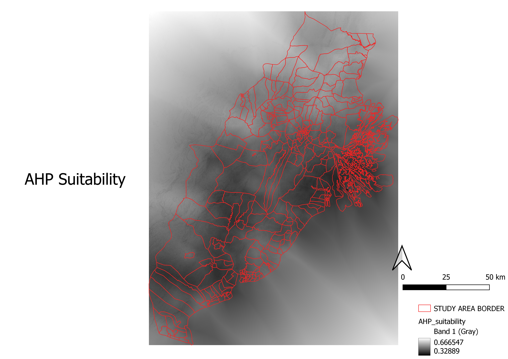

</center>

We used the factor scores derived in Figure 2. to compute the land suitability layer (Figure 3.). Locations with values closer to 1, which is represented as a whiter area on the map, are more suitable than locations with values closer to 0, which is represented as a blacker area on the map.

<center>

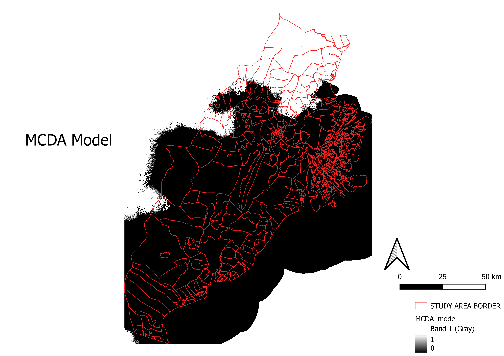

</center>

From Figure 3., we created a binary land suitability model for easier visualisation for areas that are suitable or not suitable for the new capital. It is recommended that the selected site should have at least a composite critierion scores of 0.5. As such, locations with the value of 1 denotes suitable, which is represented by white, and with the value of 0 denotes not suitable, which is represented by black. Referring to Figure 4., it is visually easier to identify areas that are suitable, which are the white areas towards the North of the study area, and we can disregard the black areas.


<center>

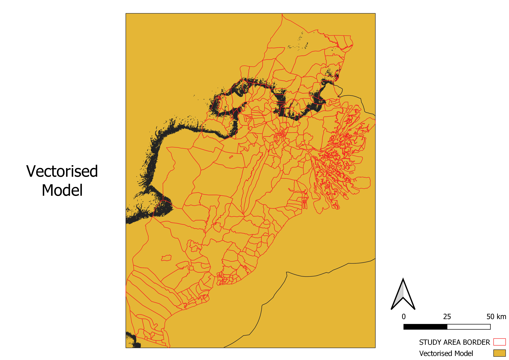
 
 </center>


<center>

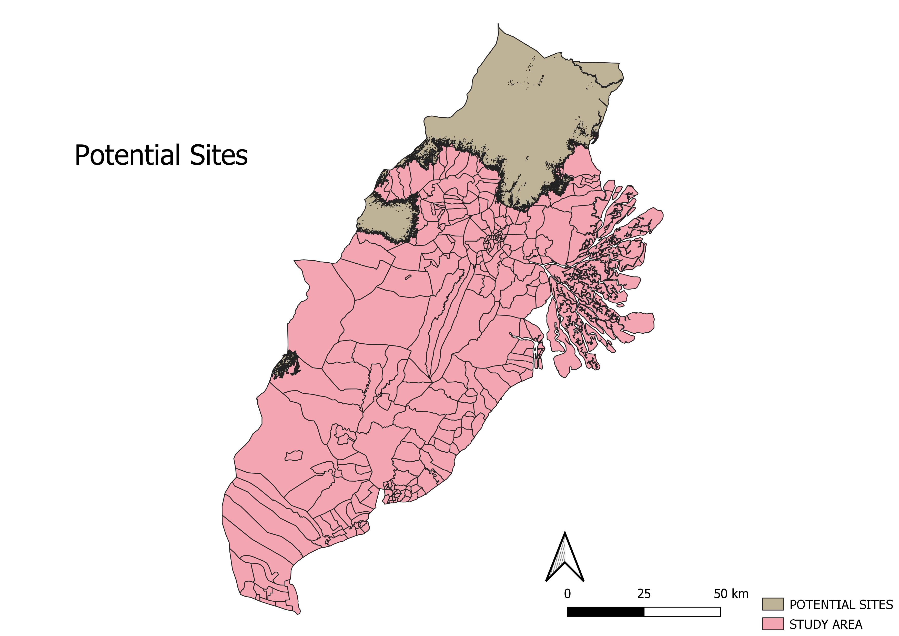


</center>

Referring to Figure 6., the brown area is identified as the potential suitable area for the new capital, which aligns with the white areas shown in Figure 4.

<center>


</center>

From Figure 6., we chose subzones where the whole area is of complete suitability, i.e. no small area within a subzone is of black colour (Figure 4.). This narrowed down the results to 8 subzones as potential final sites for the new capital.


<center>

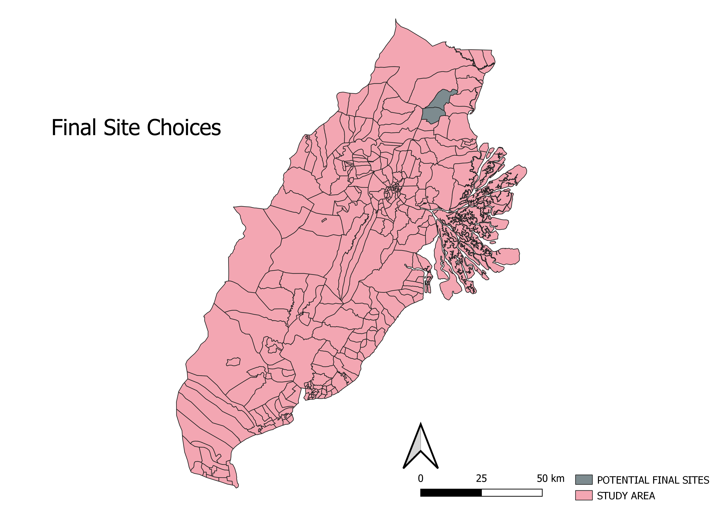


</center>

Bearing in mind that the AHP score does not account for the size of the subzone, we further narrowed down from 8 to 2 subzones by eliminating subzones that are not of 4500-5500 hectares in size. The remaining 2 subzones, shaded in grey, are Prangat Baru (bottom) and Prangat Selatan (top). 


# 1.4 Comparing the Final Sites: Prangat Baru and Prangat Selatan

As both Prangat Baru and Prangat Selatan subzones meet all the criterias of a suitable site, we did an in-depth comparison between both subzones based on the 9 criteria to determine the final suitable site for the new capital.


## 1.4.1 Comparing Distribution of Rivers

<center>

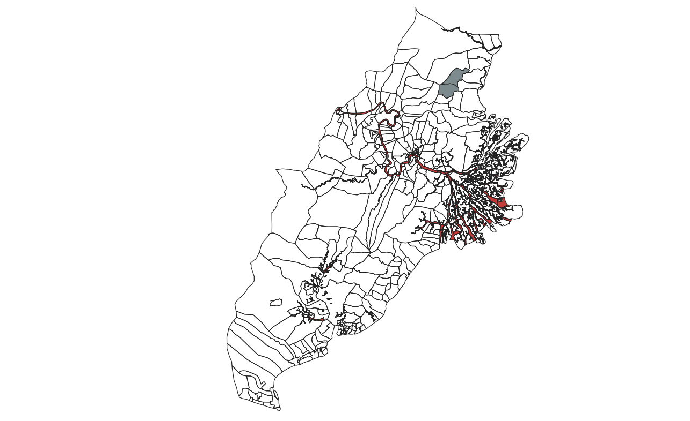

</center>

The rivers are identified by the red polygons. There are no rivers located in close proximity to Prangat Baru and Prangat Selatan. However, between Prangat Baru and Prangat Selatan, Prangar Baru is located closer to the major river in East Kalimantan.


## 1.4.2 Comparing Locations of Forests


<center>

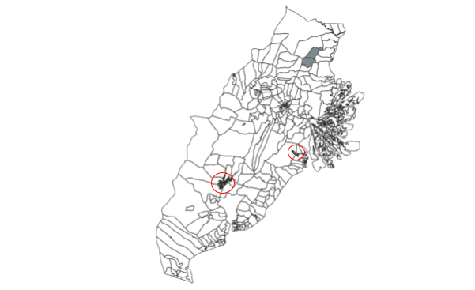

</center>


The forest areas are identified by the green polygons. However, as the size of the polygons are rather smaller, the forest areas have been identified by the red circles. There are forests located in close proximity to Prangat Baru and Prangat Selatan. Although Prangar Baru is located closer to a forest than Prangar Selatan, the distance between the forest and Prangar Baru is very great, such that there is no cause and effect relationship between the forest and Prangar Baru.


## 1.4.3 Comparing Distribution of Roads

<center>

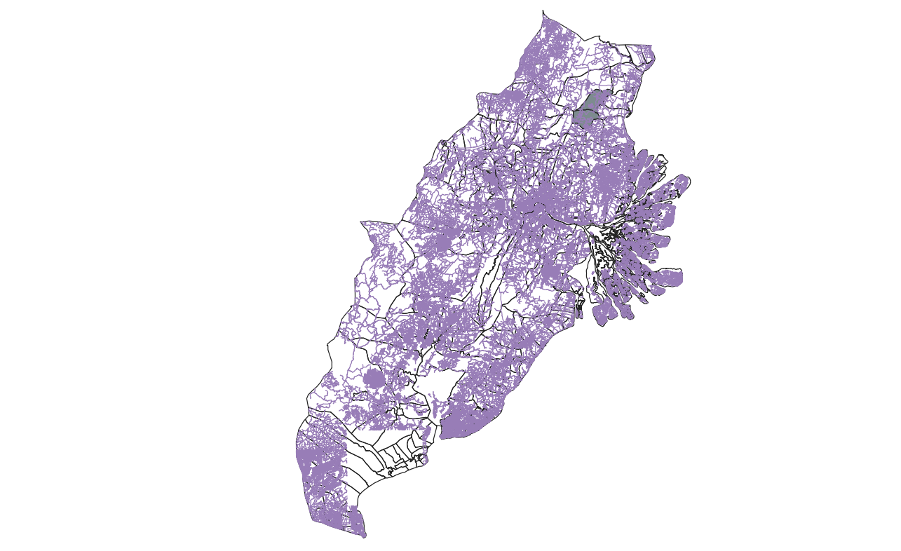

</center>

## 1.4.4 Comparing Distribution of Hotspots

<center> 

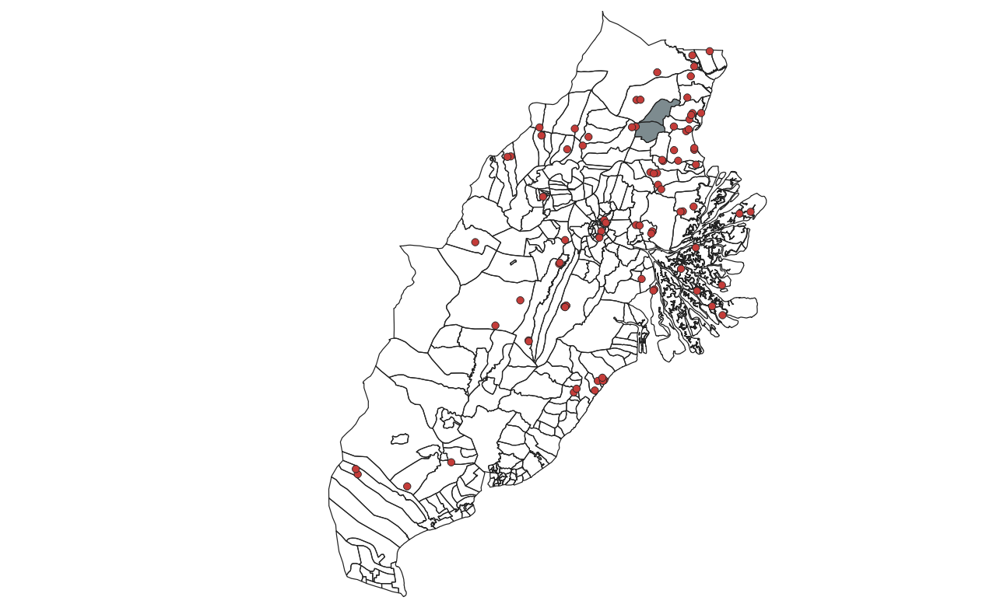

</center> 


The West of Prangat Baru has two hotspot locations, while Prangat Selatan has no hotspots located within her subzone.


## 1.4.5 Comparing Distribution of Slope

<center>

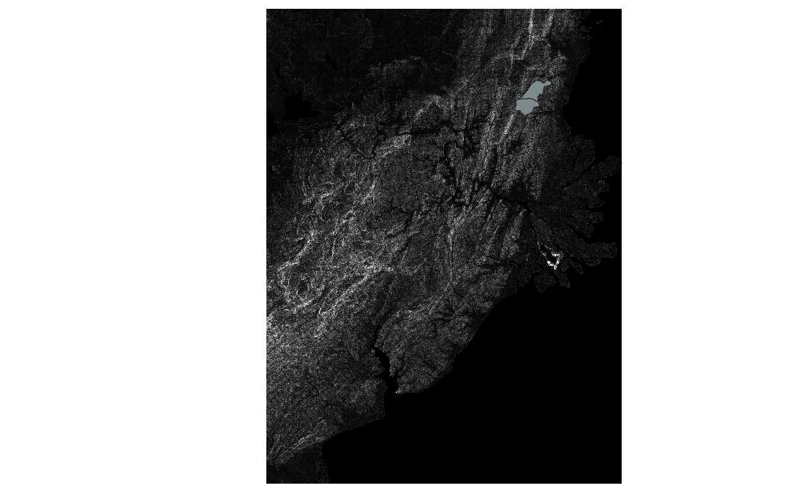

</center>


The white areas represent steeper slopes, while the darker areas represent gentler slopes. Since Prangat Baru and Prangat Selatan are neighbouring regions and referring to Figure 13., both subzones experience rather similar slopes.


## 1.4.6 Comparing Location of Airports

<center>


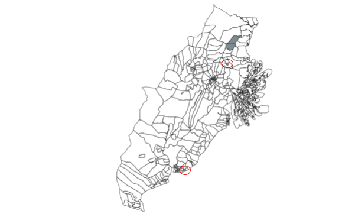


</center>


The locations of the airports can be identified by the green dot, circled by a red circle. Prangat Baru is in closer proximity to an airport than Prangat Selatan.


## 1.4.7 Comparing Distribution of Buildings

<center> 


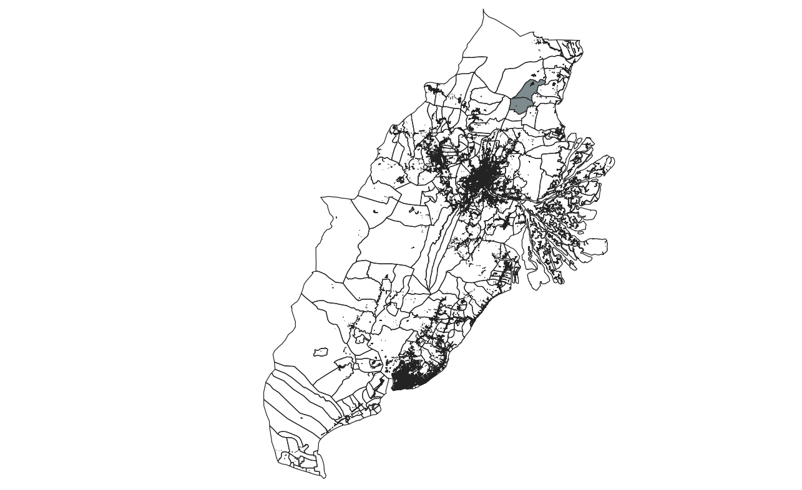


</center>

While there is a small urban settlement located within Prangat Selatan, Prangat Baru is in closer proximity to a major urban settlement than Prangat Selatan.


##1.4.8 Comparing Distribution of Coastline

<center> 


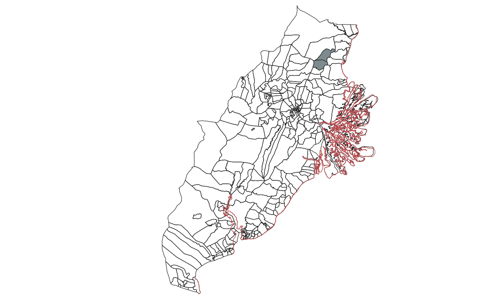

</center>

The coastline can be identified by the red lines. Both Prangat Baru and Prangat Selatan are about an equal distance from the coastline.


## 1.4.9 Comparing Locations of Seaports

<center>


</center>

The location of the seaports can be identified by the light yellow dots. Prangat Selatan is in closer proximity to a seaport than Prangat Baru.


# 1.5 Overview of Comparison between Prangat Baru and Prangat Selatan


<center>

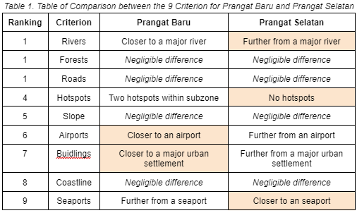

</center>


Referring to Table 1., the orange highlighted cell indicates a preference of the respective criterion for the corresponding site. Since Prangat Selatan has 3 orange highlighted cells compared to Prangat Baru with 2 orange highlighted cells, Prangat Selatan is a more ideal suitable site for the new capital. 

Moreover, out of the 3 orange highlighted cells of Prangat Selatan, 2 of them (i.e. rivers and hotspots) has a higher AHP score than the 2 orange highlighted cells (i.e. airpots and buildings) of Prangat Baru. Notably, river flooding and wildfires are natural occurrence which cannot be prevented, but only mitigated. On the other hand, being in closer proximity to airports and buildings can always be achieved indirectly, when considering travelling time, with a more efficient road network.


# 1.6 Conclusion 

<center>

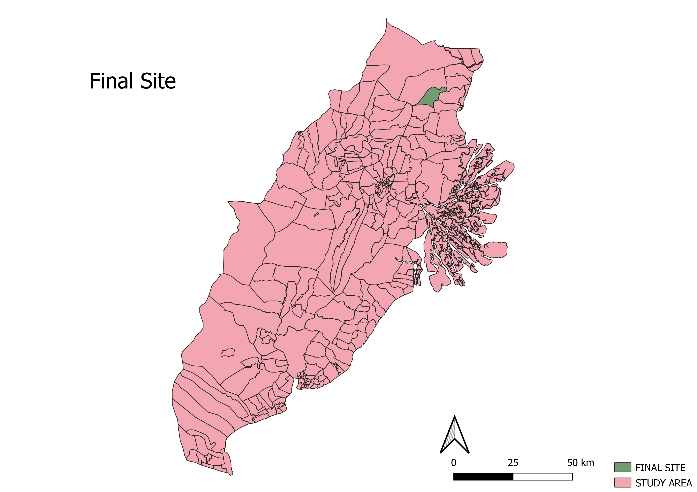

</center>


**Prangat Selatan** is the final selected suitable site for the new capital.


#1.7 References
Berti, A. (2019, June 7). Can airports help lift communities out of poverty? Airport Technology. Retrieved November 15, 2021, from https://www.airport-technology.com/features/importance-of-airports-to-a-country/. 
Chandran, R. (2019, August 30). Indigenous people under threat from Indonesia's plan to move capital. Reuters. Retrieved November 15, 2021, from https://www.reuters.com/article/us-indonesia-landrights-environment-idUSKCN1VK0L6. 
Malkoc, G. (2015, July 15). The importance of road maintenance. World Highways. Retrieved November 15, 2021, from https://www.worldhighways.com/wh8/wh9/wh10/feature/importance-road-maintenance. 
Indonesia Investments. (n.d.). Natural disasters in Indonesia. Indonesia Investments. Retrieved November 15, 2021, from https://www.indonesia-investments.com/business/risks/natural-disasters/item243.
Think Hazard. (n.d.). River flood. Think Hazard. Retrieved November 15, 2021, from https://thinkhazard.org/en/report/116-indonesia/FL. 


